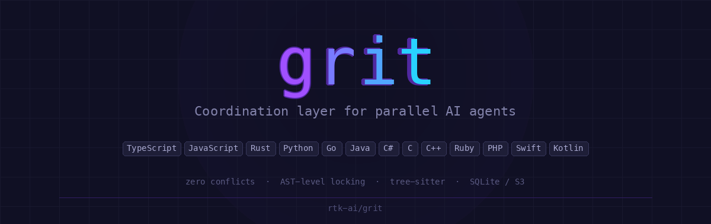
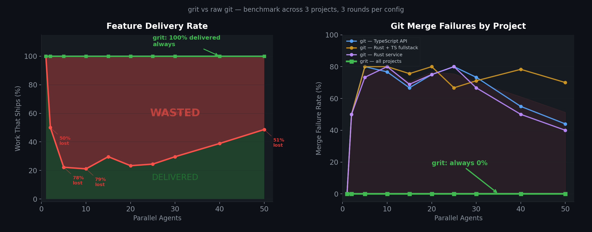

<p align="center">
  
</p>

<p align="center">
  <strong>Zero merge conflicts, any number of parallel agents, same codebase.</strong>
</p>

<p align="center">
  <a href="https://github.com/rtk-ai/grit/actions"></a>
  <a href="LICENSE"></a>
  <a href="https://github.com/rtk-ai/grit/stargazers"></a>
</p>

<p align="center">
  Translations: <a href="docs/README.fr.md">Francais</a> · <a href="docs/README.de.md">Deutsch</a> · <a href="docs/README.es.md">Espanol</a> · <a href="docs/README.pt.md">Portugues</a> · <a href="docs/README.it.md">Italiano</a> · <a href="docs/README.nl.md">Nederlands</a> · <a href="docs/README.ja.md">日本語</a> · <a href="docs/README.zh.md">中文</a> · <a href="docs/README.ko.md">한국어</a> · <a href="docs/README.ru.md">Русский</a> · <a href="docs/README.ar.md">العربية</a> · <a href="docs/README.hi.md">हिन्दी</a>
</p>

---

## The Problem

When multiple AI agents work in parallel on the same codebase, git breaks. Agents edit different functions in the same file, and git sees conflicting hunks at the line level. The merge fails — all the agent's work is thrown away.

**The more agents, the worse it gets:**

```
         RAW GIT                         GRIT
Agents  Features Lost  Work Wasted    Features Lost  Work Wasted
─────── ────────────── ────────────   ────────────── ────────────
  10       14/20          70%            0/20            0%
  20       15/20          75%            0/20            0%
  30       25/30          83%            0/30            0%
  50       45/50          90%            0/50            0%
```

With 50 agents and raw git, **90% of all work is thrown away** to merge conflicts. Each failed agent must be re-invoked — more API cost, more time, more waste.

## The Solution

Grit locks at the **function level** (AST), not the file level (lines). Different functions in the same file never conflict.

```
  Agent-1: claim login()          → Granted
  Agent-2: claim login()          → Blocked (held by Agent-1)
  Agent-2: claim logout()         → Granted ← same file, no conflict

  Agent-1: done → merge + release
  Agent-2: done → merge + release
  Result: 0 conflicts, 0 wasted work
```

## How It Works

```
  ┌──────────┐    ┌──────────┐    ┌──────────┐
  │ 1. CLAIM │───▶│ 2. WORK  │───▶│ 3. DONE  │
  │          │    │          │    │          │
  │ Lock AST │    │ Parallel │    │ Rebase + │
  │ symbols  │    │ worktrees│    │ Merge    │
  └──────────┘    └──────────┘    └──────────┘
       │               │               │
       ▼               ▼               ▼
  ┌──────────┐    ┌──────────┐    ┌──────────┐
  │ SQLite,  │    │ .grit/   │    │ Serial   │
  │ Azure or │    │ worktrees│    │ file lock│
  │ S3 store │    │ /agent-N │    │ → merge  │
  └──────────┘    └──────────┘    └──────────┘
```

1. **Claim** — agent locks specific functions. Other agents are blocked from editing those functions.
2. **Work** — each agent works in its own git worktree. Full isolation, true parallelism.
3. **Done** — auto-commit, rebase on main, merge. Merges are serialized via file lock to prevent `index.lock` races.

## Supported Languages

Grit uses [tree-sitter](https://tree-sitter.github.io/) to parse ASTs. 13 languages supported:

| Language | Symbols Extracted |
|----------|-------------------|
| TypeScript / TSX | functions, classes, methods, interfaces, types, enums |
| JavaScript / JSX | functions, classes, methods |
| Rust | functions, structs, enums, traits, impls, types |
| Python | functions, classes |
| Go | functions, methods, types |
| Java | methods, classes, interfaces, enums |
| C# | methods, classes, interfaces, structs, enums, namespaces |
| C | functions, structs, enums, typedefs |
| C++ | functions, classes, structs, enums, namespaces |
| Ruby | methods, classes, modules |
| PHP | functions, methods, classes, interfaces, traits, enums |
| Swift | functions, classes, structs, enums, protocols |
| Kotlin | functions, classes, objects, interfaces |

## Backends

### Local (default)

SQLite WAL for single-machine coordination. Zero setup.

```bash
grit config set-local
```

### Azure Blob Storage (recommended for teams)

Native API with **atomic locking** (`If-None-Match: *`) and **free events** via Azure Event Grid. Every `claim` and `release` fires a `BlobCreated`/`BlobDeleted` event — no polling needed.

```bash
grit config set-azure \
  --account <storage-account> \
  --access-key <key> \
  --container grit-locks
```

**Tested with 50 agents in parallel on Azure Blob Storage:**

```
Agents │ Merges │ Conflicts │ Locks left │ Azure blobs left │ Time
───────┼────────┼───────────┼────────────┼──────────────────┼──────
    10 │     20 │         0 │          0 │                0 │   6s
    20 │     40 │         0 │          0 │                0 │   6s
    30 │     54 │         0 │          0 │                0 │  11s
    50 │     54 │         0 │          0 │                0 │  11s
    50 │     76 │         0 │          0 │                0 │  24s  (pi-calc, 44 symbols)
```

### S3-Compatible (AWS, R2, MinIO)

Works with any S3-compatible provider. Atomic locking via conditional PUT on AWS S3 and Cloudflare R2.

```bash
grit config set-s3 \
  --bucket my-bucket \
  --endpoint https://... \
  --region auto
```

| Provider | Atomic Locking | Events |
|----------|:---:|:---:|
| **Azure Blob** | `If-None-Match` (native) | Event Grid (free, 100K/mo) |
| **AWS S3** | `If-None-Match` (native) | S3 Event Notifications |
| **Cloudflare R2** | `If-None-Match` (native) | — |
| **MinIO** | GET-then-PUT (fallback) | — |

## Install

```bash
cargo install --git https://github.com/rtk-ai/grit
```

## Quick Start

```bash
cd your-project
grit init                    # Parse AST, build symbol index + dependency graph

# Agent claims functions before editing
grit claim -a agent-1 -i "add validation" \
  src/auth.ts::validateToken \
  src/auth.ts::refreshToken

# Agent works in isolated worktree: .grit/worktrees/agent-1/
# ... edit files ...

# Finish: auto-commit, rebase, merge, release locks
grit done -a agent-1
```

## Commands

### Core Workflow

```bash
grit init                                    # Parse AST, build symbol + deps index
grit claim -a <agent> -i <intent> <syms...>  # Lock symbols + create worktree
grit done  -a <agent>                        # Merge + release locks
grit status                                  # Show active locks
grit symbols [--file <pattern>]              # List indexed symbols
grit plan -a <agent> -i <intent>             # Search symbols + show deps
```

### Lock Modes

```bash
# Exclusive write lock (default)
grit claim -a agent-1 --mode write src/auth.ts::login

# Shared read lock (multiple readers allowed)
grit claim -a agent-2 --mode read src/auth.ts::login

# Dependency-aware: auto-lock callees as read
grit claim -a agent-1 --with-deps src/auth.ts::login
# → Granted: login (write), validateToken (read), hashPassword (read)
```

### Queue (contested symbols)

```bash
# If blocked, join queue instead of failing
grit claim -a agent-2 --queue src/auth.ts::login
# → Queued (position 1). Auto-granted when agent-1 releases.

grit queue list                              # Show all queued agents
grit queue cancel -a agent-2                 # Leave the queue
```

### Auto-Assignment

```bash
# Auto-pick a free symbol from matching files
grit assign -a agent-1 -i "add logging" --file src/auth
# → Assigned: src/auth.ts::logout
```

### Session Workflow

```bash
grit session start auth-refactor     # Create branch grit/auth-refactor
# ... agents claim, work, done ...
grit session pr                      # Push branch + create GitHub PR
grit session end                     # Cleanup, back to base branch
```

### Monitoring & Events

```bash
grit watch                           # Real-time event stream (Unix socket)
grit watch --poll 5                  # Polling mode (for S3/distributed backends)
grit gc                              # Clean expired locks
grit heartbeat -a <agent> --ttl 900  # Refresh lock TTL
```

On Azure, events are automatic via Event Grid — every `claim` fires `BlobCreated`, every `release` fires `BlobDeleted`. Agents can subscribe to these events for real-time coordination without polling.

### Backend Configuration

```bash
grit config show                                                          # Current config
grit config set-local                                                     # SQLite WAL (default)
grit config set-azure --account <name> --access-key <key> --container <c> # Azure Blob
grit config set-s3 --bucket <name> --endpoint <url> --region <r>          # S3/R2/MinIO
```

## Architecture

```
┌──────────────────────────────────────────┐
│              your git repo               │
├──────────────────────────────────────────┤
│  .grit/                                  │
│  ├── registry.db    (SQLite WAL)         │  ← symbols + locks + deps + queue
│  ├── config.json                         │  ← backend config
│  ├── room.sock      (Unix socket)        │  ← real-time events (local)
│  ├── merge.lock     (file lock)          │  ← serializes git merges
│  └── worktrees/                          │
│      ├── agent-1/   (git worktree)       │  ← isolated working dir
│      ├── agent-2/                        │
│      └── agent-N/                        │
├──────────────────────────────────────────┤
│  Backends:                               │
│  ├── Local: SQLite WAL (default)         │
│  ├── Azure Blob Storage (native)         │  ← atomic + Event Grid
│  ├── AWS S3 (conditional PUT)            │
│  ├── Cloudflare R2                       │
│  └── MinIO (self-hosted)                 │
└──────────────────────────────────────────┘
```

## Troubleshooting

**`grit done` reports "main worktree has uncommitted changes"** — the merge is
skipped on purpose to avoid corrupting the repo. Commit or stash the changes in
your main checkout, then run `grit done` again. The agent branch `agent/<name>`
is kept intact, so no work is lost.

**`grit claim` says a symbol "is not in the registry"** — the symbol was never
indexed. Run `grit symbols` to list indexed symbols, or re-run `grit init` if
the codebase changed since the last scan.

**Relative-path dependencies break inside `.grit/worktrees/`** — a worktree
lives a few directories below the repo root, so a Cargo/npm dependency declared
with a relative path (e.g. `path = "../sibling"`) resolves to the wrong place.
Symlink the dependency next to the `worktrees` directory, or use an absolute
path in the manifest.

## Benchmarks

<p align="center">
  
</p>

Tested across 3 projects (ts-api, pi-calc, rust-service), 1 to 50 agents, 3 rounds each:

```
         RAW GIT                         GRIT
Agents  Merge Failures  Work Wasted    Merge Failures  Work Wasted
─────── ──────────────  ───────────    ──────────────  ───────────
     1       0%             0%              0%             0%
     2      50%            50%              0%             0%
     5      80%            80%              0%             0%
    10      80%            80%              0%             0%
    20      75%            75%              0%             0%
    30      73%            73%              0%             0%
    50      51%            51%              0%             0%
```

> With 10 agents: git throws away **80% of all work**. Grit throws away **0%**.

### Run benchmarks

```bash
# Feature throughput sweep (10, 20, 30, 50 agents)
./scripts/throughput/bench.sh --sweep

# Synthetic merge conflict test
./scripts/synthetic/bench.sh --agents 50 --rounds 5

# Sweep across projects
./scripts/sweep/bench.sh --agents "10 20 30 50" --projects "ts-api rust-service py-ml"

# Real AI agents (Claude / Gemini)
./scripts/ai-agents/bench.sh --agents 10 --provider claude
./scripts/ai-agents/bench.sh --agents 20 --provider gemini
```

## Part of the RTK AI Ecosystem

| Project | Description |
|---------|-------------|
| [rtk](https://github.com/rtk-ai/rtk) | Token-optimized CLI proxy (60-90% savings) |
| [icm](https://github.com/rtk-ai/icm) | Infinite Context Memory for AI agents |
| [vox](https://github.com/rtk-ai/vox) | Cross-platform TTS with MCP server |
| **grit** | Coordination layer for parallel AI agents |

## License

Licensed under the [Apache License, Version 2.0](LICENSE).

Copyright (c) 2025-2026 RTK AI. All rights reserved.
